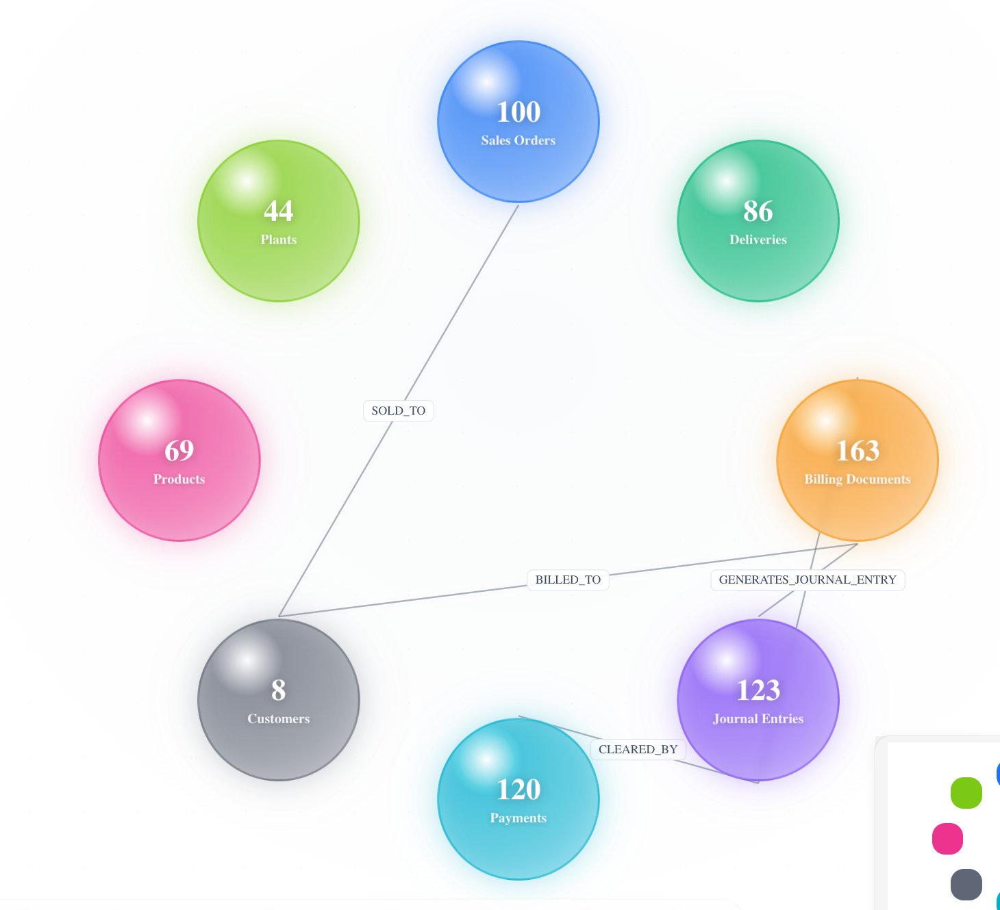
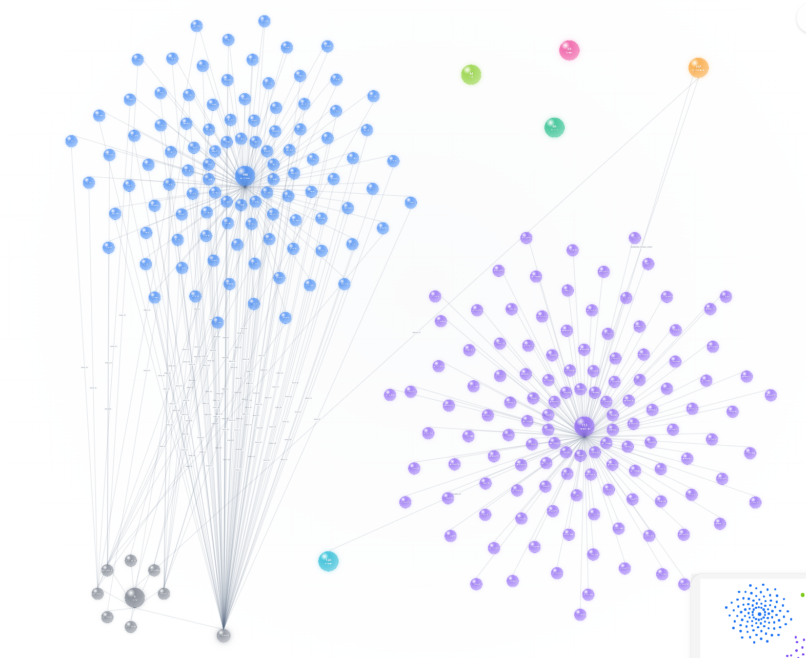
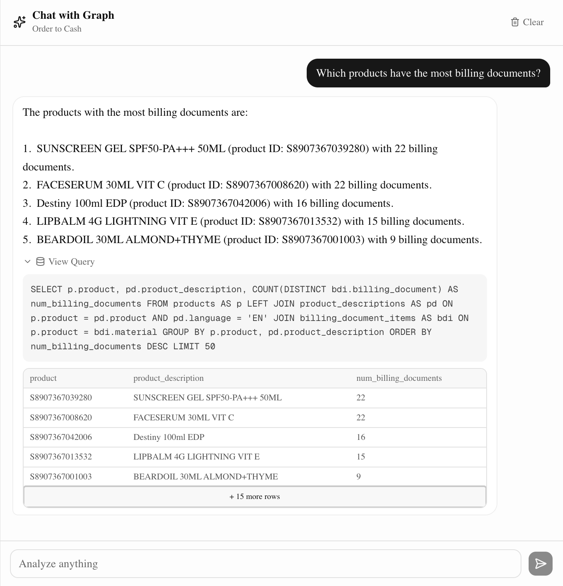
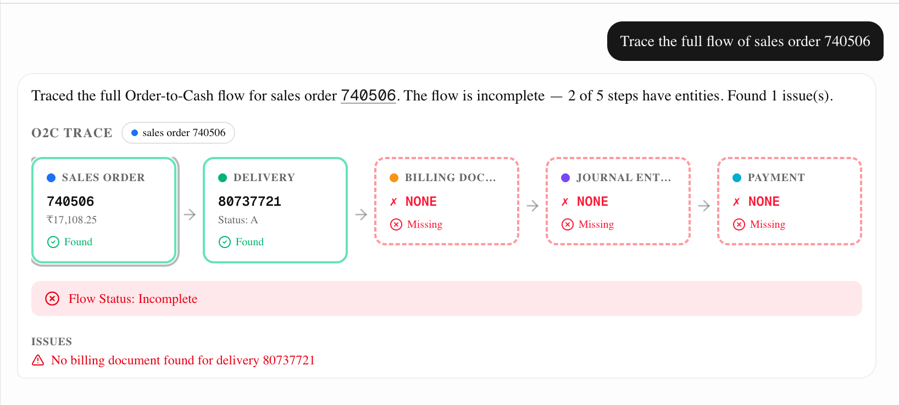
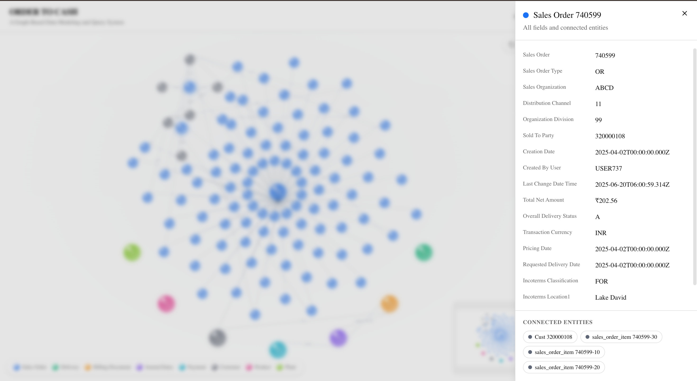

# Graph-Based Data Modeling and Query System

> **An interactive, LLM-powered graph visualization and query system.**

This project lets you visualize interconnected business entities as a dynamic, explorable graph and query them using plain English. The system translates natural language into precise SQL, executes it against the database, and streams back data-backed answers with full transparency into every generated query.

**Live Demo:** [https://dodge-liart.vercel.app](https://dodge-liart.vercel.app)

---

##  Architecture Decisions

The architecture is designed for performance, reliability, and seamless full-stack integration.

* **Framework: Next.js (App Router)**
  Maintains the entire application — frontend visualization, streaming API routes, and database access in a single deployable unit. Server-side route handlers keep API keys off the client and enable streaming responses natively.

* **Visualization: React Flow (@xyflow/react)**
  Powers the interactive graph with first-class support for zooming, panning, custom nodes, and dynamic layout. Entity clusters expand into individual nodes on click, and neighbor graphs can be explored by drilling into any entity.

* **Intelligence: Two-Pass LLM Pipeline (Gemini 2.5 Flash and Gemini 2.5 Flash Lite)**
  Rather than relying on an LLM to guess answers, the pipeline grounds every response in real data:
  1. **Pass 1 — SQL Generation:** Translates the user's question into a precise `SELECT` query using Gemini's native JSON output mode at temperature 0.
  2. **Pass 2 — Streaming Summarization:** Takes the exact rows returned by the database and streams a clear, natural-language summary back to the user in real time.

  The LLM layer includes **automatic model rotation** (primary → `gemini-2.5-flash`, fallback → `gemini-2.5-flash-lite`) with retry logic on rate limits, plus an **in-memory response cache** (SQL, summaries, and trace extractions) to minimize redundant API calls.

---

##  Database Design

The data layer runs on **PostgreSQL** (via Neon Serverless) with **Drizzle ORM**. Graph relationships are represented directly in PostgreSQL using a dedicated `graph_edges` table with indexed source/target columns.

**Why this works well:**

* **Reliable SQL generation** — LLMs are exceptionally well-trained on standard SQL schemas, so the NL-to-SQL engine produces highly accurate queries without needing a graph query language.
* **Relational integrity + graph traversal** — Core entity tables enforce typed columns, composite primary keys, and proper foreign key semantics. The `graph_edges` table (with `source_type`, `source_id`, `target_type`, `target_id`, and JSONB metadata) provides the flexible traversal needed for the frontend graph and the O2C flow tracer.
* **Operational simplicity** — One connection string, one schema, one hosting provider. No secondary graph database to sync or maintain.

**Entity tables:** `sales_orders`, `sales_order_items`, `deliveries`, `delivery_items`, `billing_documents`, `billing_document_items`, `journal_entries`, `payments`, `customers`, `customer_addresses`, `products`, `product_descriptions`, `plants`

---

##  Guardrails Pipeline

A three-layer safety pipeline ensures the system stays secure, performant, and strictly scoped to business data.

1. ** Layer 1: Keyword Filter (Instant)**
   A zero-cost allow/block list runs before any API call. Messages containing O2C terms (`order`, `delivery`, `billing`, `payment`, etc.) are immediately allowed; clearly off-topic inputs (`recipe`, `poem`, `weather`, etc.) are instantly rejected.

2. ** Layer 2: LLM Classifier (Contextual)**
   Ambiguous messages that pass through the keyword filter are sent to a lightweight, single-token Gemini call (`gemini-2.5-flash-lite`) that answers: *"Is this about Order-to-Cash data? YES/NO."* The system fails open — if the classifier errors, the query proceeds rather than blocking a legitimate request.

3. ** Layer 3: SQL Validation (Execution Safety)**
   Before any generated query touches the database, it must pass structural checks:
   - Must be a `SELECT` statement (no `INSERT`, `UPDATE`, `DELETE`, `DROP`, `ALTER`, etc.)
   - No semicolons, line comments (`--`), or block comments (`/*`)
   - No `SELECT INTO` patterns
   - 2,000-character hard limit
   - 10-second execution timeout

---

##  O2C Flow Tracer

A standout feature: given any entity ID (sales order, delivery, billing document, journal entry, or payment), the tracer reconstructs the **complete Order-to-Cash flow** using bidirectional traversal.

**How it works:**
1. **Backward trace** — Walks from the input entity back to the root sales order.
2. **Forward trace** — From the root, walks forward through all five O2C steps.
3. **Issue detection** — Flags broken flows (missing deliveries, unbilled shipments, cancelled invoices, uncleared receivables).

The tracer is accessible both via the `/api/trace` endpoint and through natural language in the chat panel — queries like *"trace the flow for order 740506"* are automatically routed to the trace pipeline.

---

##  Project Structure

```text
src/
├── app/
│   ├── page.tsx                 
│   └── api/
│       ├── graph/route.ts       
│       ├── chat/route.ts        
│       ├── trace/route.ts       
│       └── node/[id]/route.ts   
├── components/
│   ├── GraphCanvas.tsx          
│   ├── ChatPanel.tsx            
│   ├── NodeDetail.tsx           
│   └── TraceFlow.tsx            
├── db/
│   ├── schema.ts                
│   └── client.ts                
├── lib/
│   ├── llm.ts                   
│   ├── guardrails.ts            
│   └── sql-executor.ts          
└── scripts/
    ├── preprocess.ts            
    └── ingest.ts                
```

---

##  Tech Stack

| Layer | Technology |
|---|---|
| Framework | Next.js (App Router) |
| Language | TypeScript |
| Frontend | React, React Flow, Tailwind CSS, shadcn/ui |
| LLM | Google Gemini |
| Database | PostgreSQL (Neon Serverless) |
| ORM | Drizzle ORM + Drizzle Kit |
| Deployment | Vercel |

---
##  Demo Walkthrough
 
Open the [live demo](https://dodge-liart.vercel.app) and try the following:
 
**1. Explore the graph**
The landing view shows entity clusters (Sales Orders, Deliveries, Customers, etc.) connected by relationship edges. Click any cluster to expand it into individual entity nodes. Click a specific node to open its detail panel with all fields and connections.
 
**2. Ask a question in the chat panel**
Type a natural language question in the right-side chat. The system translates it to SQL, runs it, and streams back a plain-English answer. You can expand the SQL block under any response to see exactly what query was generated.
 
**3. Trace an O2C flow**
Ask something like *"Trace the flow of sales order 740506"* — the system walks the full Order → Delivery → Billing → Journal Entry → Payment chain and flags any broken links or missing steps.

---

##  Screenshots
 
<!-- Replace these placeholders with actual screenshots from the live app -->
 
| View | Screenshot |
|---|---|
| Graph Overview 1 |  |
| Graph Overview 2 |  |
| Chat with SQL Transparency |  |
| O2C Flow Trace |  |
| Entity Detail Panel |  |

---
